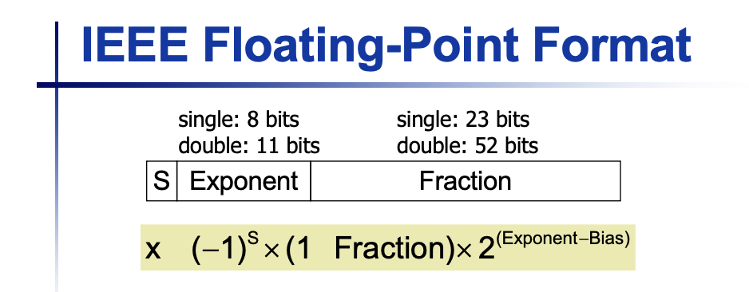
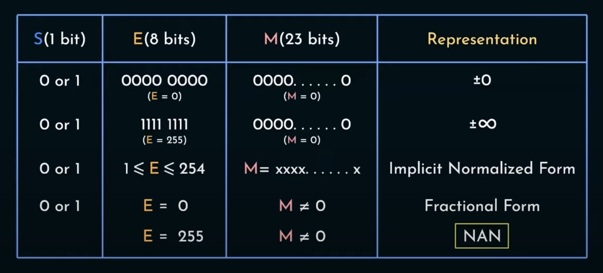

# Floating Point Numbers in Binary
To convert a binary floating point number to decimal, we could do the usual thing of multiplying 2 to the power of bit position times 1 or 0. Now positions after the dot will start from -1 to -infinity.

$(101.101)_2 = 5.625$

Some floating point decimal numbers can only be approximated by binary.

EX: $(0.2)_{10} = (0.001100110011\dots)_{2}$

## IEEE 754 Standard

## Floating Point Multiplication
1) Add the exponent and subtract 127 by number of numbers you multiply - 1 to prevent subtracting 127 multiple times.
2) Multiply the Mantissa (fraction) just like what we do in decimal (be careful of decimal point's placement). Normalize if necessary to make the first digit 1 and account for the shifting in exponent.