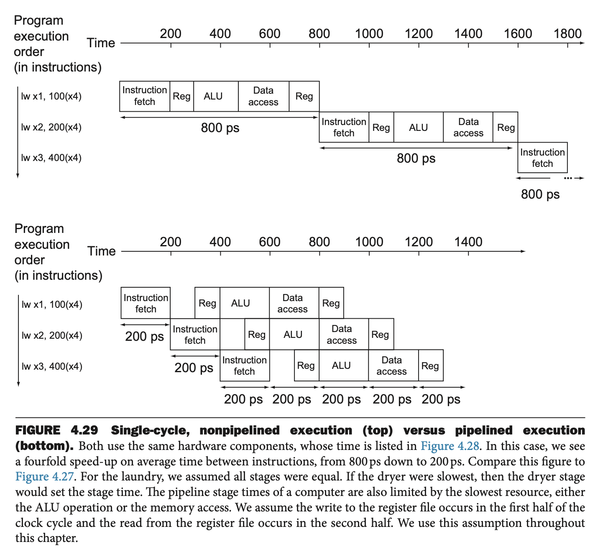
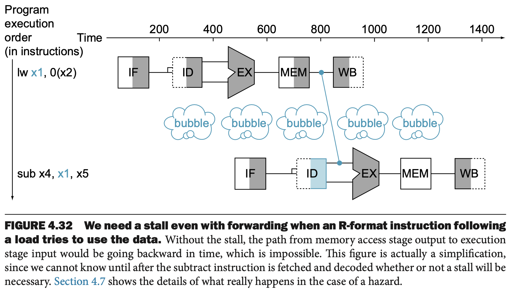
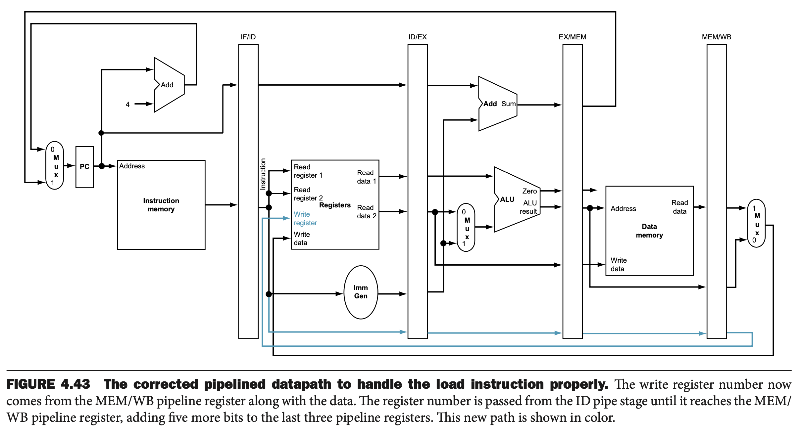

# The Processor
In RISC-V ISA, executing every instruction first needs these two steps:
1. Send the PC to the memory that contains the code and fetch the instruction from that memory.
2. Read one or two registers whose numbers are determined by fields of the instruction. 

After these two steps, the action depends on the instruction class (ex: logical or arithmetic), but all will need to use arithmetic logical unit (ALU) first. 

At the end, increment PC by 4 and fetch the next instruction.

## 1st Layer of CPU

* All instruction start by using the program counter to get the instruction from the instruction memory. 
* After the instruction is fetched, the register operands are specified by fields of that instruction. 
* Once the register operands are fetched, they can be operated on to compute a memory address (for lw or sw), for arithmetic computation (add or shift), or an equality check (branch).
* The result from the ALU or memory is written back into the register file. Branch requires the ALU output to determine the next PC.
* NOTE: thick lines are buses representing multiple signals. The arrows guide the information flow.

## 2nd Layer of CPU

* The top Multpilexor controls whether PC should go to the next line or branch. 
* This top multiplexor is controlled by ANDing the Zero output of the ALU and a control signal that indicates the instruction is a branch. 
* The middle multiplexor's output returns to the register file. It's used to steer the output of the ALU (for arithmetic and logical instruction) or load data from the memory to the register. 
* The bottom-most multiplexor is used to determine whether the second ALU input is from the register (for arithmetic, logical, and branch) or from the offset field of the instruction (lw or sw). 

## Review of Digital Logic
* **Combinational Element:** an operational element, such as an AND gate or an ALU. EX: Adder
* **State Element:** a memory element, such as a register or a memory. A state element has two inputs and an output. It requires the data value to be written into the element and the clock, which determines when the data value is written; a state element can be read at any time.
EX: D-Flip-Flop.

We will assume **positive edge-triggered clocking**, in which all state changes occur on a clock edge.


All signals must propagate from state element 1, through the combinational logic, and to state element 2 in the time of one clock cycle. The time necessary for the signals to reach state element 2 defines the length of the clock cycle.

## Datapath
* Datapath Element: a unit used to operate on or hold data within a procesor. EX: instruction, data memory, register file, ALU, and adder.

### PC


* A register file is a collection of registers in which any register can be read or written by specifying the number of the register in the file.


### Register file


### Memory unit


The branch instruction operates by adding the PC with the 12 bits of the instruction shifted left by 1 bit. Concatenating to the branch offset accomplishes this shift.

### Branch


### Data Path for R-Type Instruction


**ALU Control Inputs**


**Control Unit**


## Exercise


### Data Path


### Waveform


### Latency and Clock Period
* R-Type Instruction = Register Read (30 ps) + I-Mem (250 ps) + Register File (150 ps) + Mux (25 ps) + ALU (200 ps) + Mux (25 ps) + Register Setup (20 ps) = 700 ps
* lw (load word) = Register Read (30 ps) + I-Mem (250 ps) + Register File (150 ps) + Mux (25 ps) + ALU (200 ps) + D-Mem (250 ps) + Mux (25 ps) + Register Setup (20 ps) = 950 ps
* sw (store word) = Register read (30 ps) + I-Mem (250 ps) + Register File (150 ps) + Mux (25 ps) + ALU (200 ps) + D-Mem (250 ps) = 905 ps
* Branch = Register read (30 ps) + I-Mem (250 ps) + Register File (150 ps) + Mux (25 ps) + ALU (200 ps) + Single gate (5 ps) + Mux (25 ps) + Register Setup (20 ps) = 705 ps
* Arithmetic, logical, shift I-type instruction = Register Read (30 ps) + I-Mem (250 ps) + Register File (150 ps) + Mux (25 ps) + ALU (200 ps) + Mux (25 ps) + Register Setup (20 ps) = 700 ps

## Pipelining
On the data path example above, the longest path in the CPU determines the clock cycle, which is likely a load instruction.

Because we must assume that the clock cycle is equal to the worst-case delay for all instruction, the clock period is high and we **fail to make the common case fast**, as the instruction requiring the most delay may not occur frequently.

We want to pipeline the CPU by sharing the same hardware across different instructions at one time. This increases the CPI but decreases the clock period.



Pipelining increases the number of simultaneously executing instructions and the rate at which instructions are started and completed. Pipelining does not reduce the time it takes to complete an individual instruction.

### Hazards

* **Structural Hazard**: when a planned instruction cannot execute in the proper clock cycle because the hardware does not support the combination of instructions that are set to execute. EX: If our instruction memory and data memory are not separate, the first instruction in the pipeline will access data while the fourth instruction will try to fetch an instruction.
* **Data Hazard**: When a pllaned instruction cannot execute in the proper clock cycle because data that are needed to execute the instruction are not yet available. 
EX: dependency on x19
```
add x19, x0, x1
sub x2, x19, x3
```
To resolve this, we could add extra hardware to send the ALU result directly to the 2nd stage. This is called **forwarding**

However, forwarding cannot prevent the load-data hazard where data is being loaded after the 4th stage, but the next instruction may need it in the 3nd stage.



* **Control Hazard**: when the proper instruction cannot execute in the proper pipeline clock cycle because the instruction that was fetched is not the one that is needed.

### Pipelined Datapath
