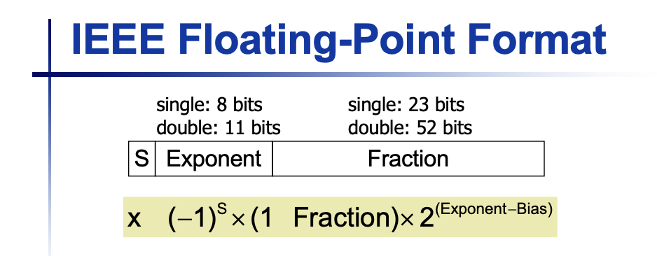
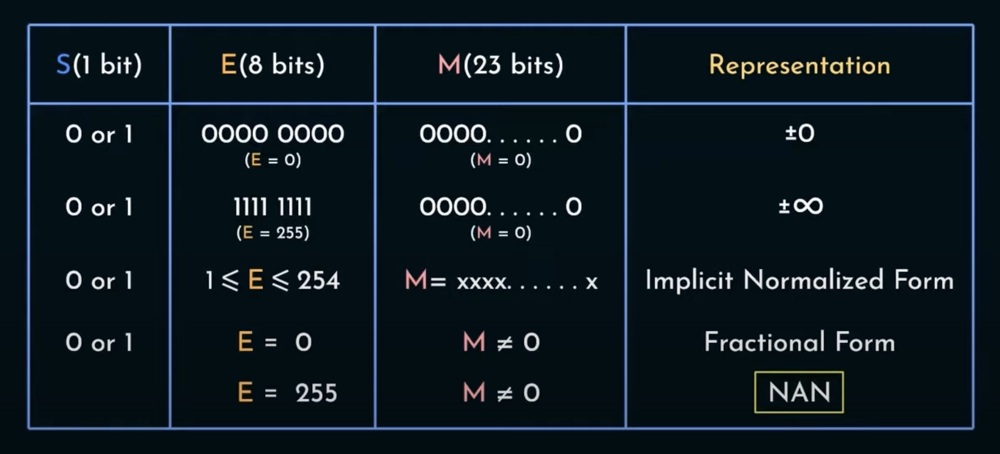

# Chapter 2 - Arithmetic in Computer

EX: $(0.2)_{10} = (0.001100110011\dots)_{2}$

## 1. IEEE 754 Standard

## 2. Floating Point Multiplication
1) Add the exponent and subtract 127 by number of numbers you multiply - 1 to prevent subtracting 127 multiple times.
2) Multiply the Mantissa (fraction) just like what we do in decimal (be careful of decimal point's placement). Normalize if necessary to make the first digit 1 and account for the shifting in the exponent.