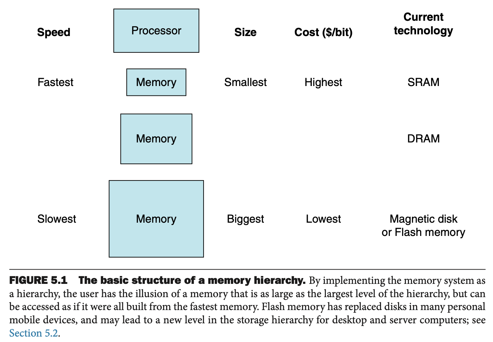
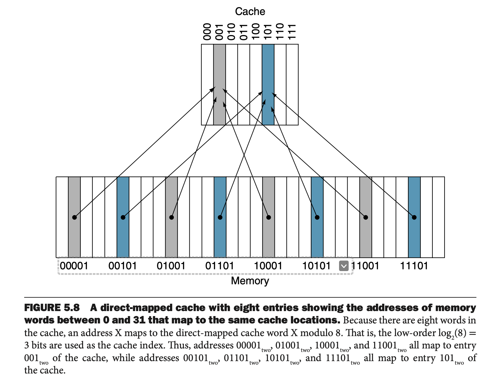
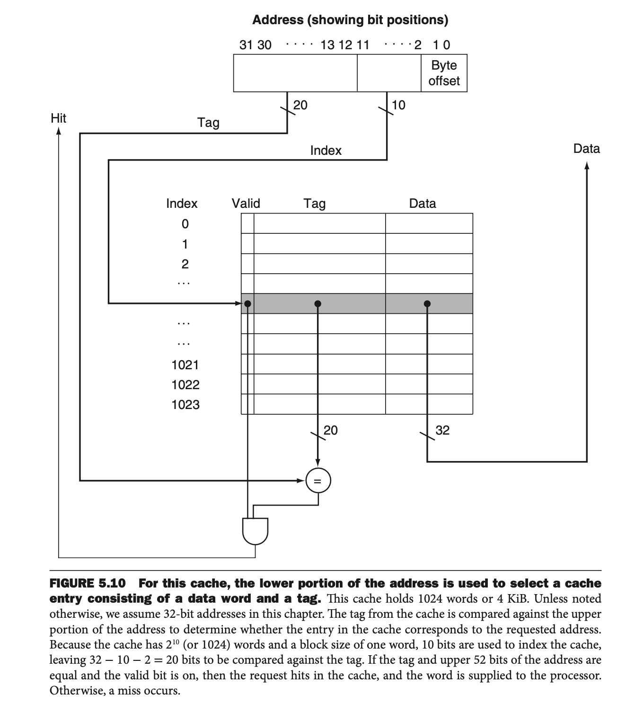
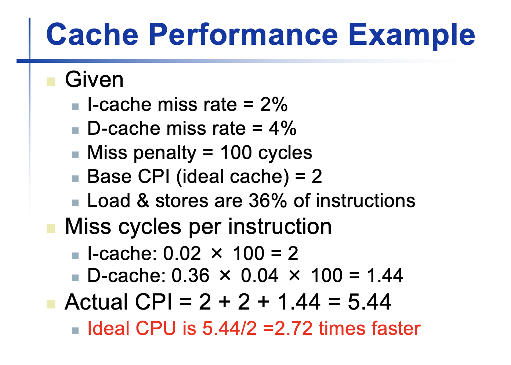
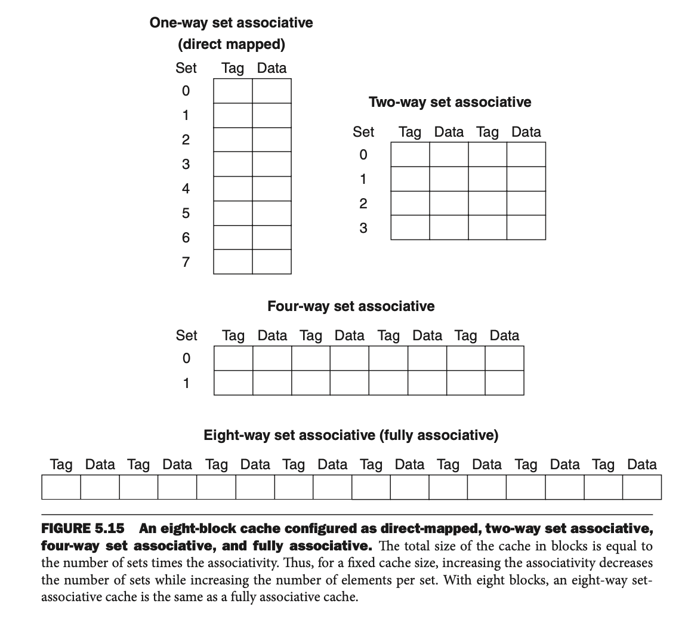
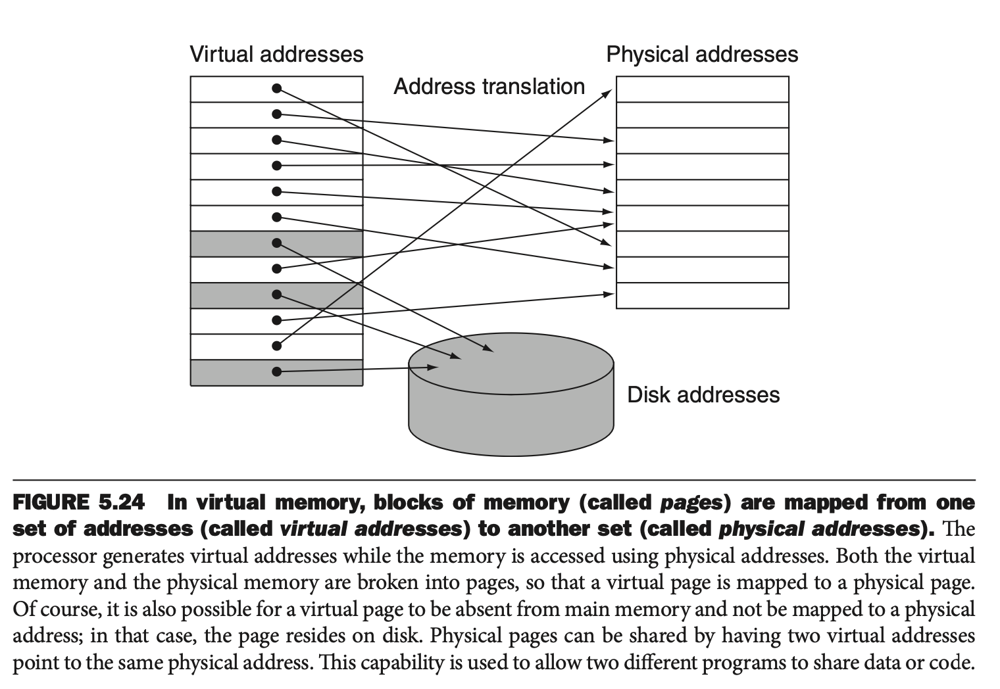
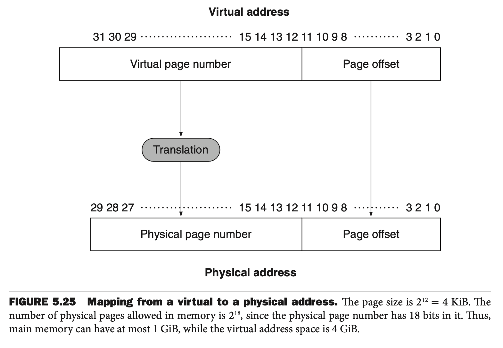
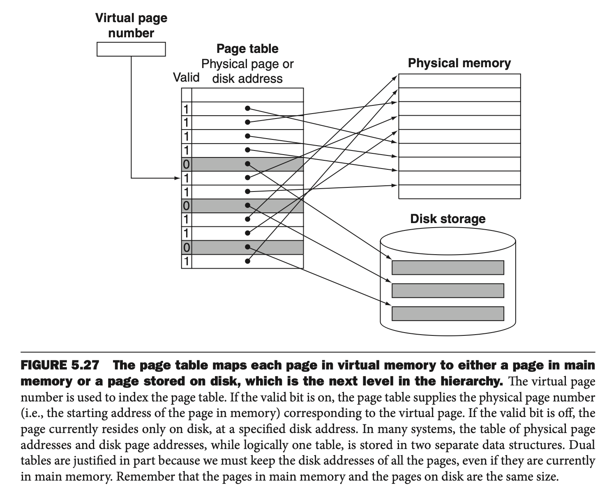

# Chapter 4 - Memory

**Temporal Locality**: the principle that if a data location is referenced then it will tend to be referenced again soon.

**Spatial Locality**: the principle that if a data location is referenced, data locations with nearby addresses will tend to be referenced soon.

**Block**: the minimum unit of information that can be either present or not present in a cache.

**Hit rate**: the fraction of memory accesses found in a level of the memory hierarchy.

**Miss rate**: the fraction of memory accesses not found in a level of the memory hierarchy.

**Hit time**: the time required to access a level of the memory hierarchy, including the time needed to determine whether the access is a hit or miss.

**Miss penalty**: the time required to fetch a block into upper level of the memory hierarchy from the lower level, including the time to access the block, transmit it from one level to the other, insert it in the level that experienced the miss, and then pass the block to the requestor.

## 1. Cache
We want to assign a memory word a cache location with direct mapping, which each memory is mapped to exactly one location in the cache.

A common way to get the cache address is through:

**(Block address) modulo (Number of blocks in the cache)**

* If the number of entries in the cache is a power of 2, then we could do the % operation by reading the lower-order $log_2$ (cache size in blocks) bits of the memory address.
* EX: If cache size is 2, the cache address of a memory address is determined by the first bit of the memory address.

**Tag**
* Many words could be assigned to the same cache block.
* Tag contains the address information required to identify whether a word in the cache corresponds to the requested word.
* **The tag needs to contain the upper portion of the address.**

**Valid Bit**
* The valid bit indicates whether an entry contains a valid address.

**The following offsets are used in memory**
* The **byte offset** is used to access a specific byte of the word in each block. It's also called the **word-offset**. We could find the offset by $log_2$(number of byte in a word or double word).
* The **block offset** is used to access a word in a block. We could find it by $log_2$(number of word per block).

**Size of a Cache**
* The cache size is $2^n$ blocks, so n bits are used for the index.
* The block size is $2^n$ words, so m bits are used for the word within the block, and two bits are used for the byte part of the address.
* The size of the tag field is $32 - (n + m + 2)$
* The total number of bits is: $2^n$ * (block size + tag size + valid field size)

**Steps the Processor takes on a Cache Miss**
1. Send the original cache-missed PC value to the instruction register.
2. Instruct main memory to perform a read and wait for the memory to complete its access.
3. Write the cache entry, putting the data from the memory in the data portion of the entry, writing the upper bits of the address into the tag field, and turning the valid bit on if it's not on.
4. Restart the instruction execution at the first step, which will refetch the instruction, this time finding it in the cache.

**Handling Writes**
* If on a store instruction, we write the data only to the data cache (without changing the main memory), then the cache and memory will be inconsistent.
* A potential solution is **write-through**, in which writes always update both the cache and the next lower level of the memory hierarchy. On a write miss, we will place the written block into the cache.
* To help the write through, we could use the **write buffer**, which stores the data while they are waiting to be weitten to memory. After writing the data into the cache and into the write buffer, the processor can continue execution. When a write to main memory completes, the entry in the write buffer is freed. 
* Another solution is **write-back**. When a write occurs, the new value is written only to the cache block. The modified block is written to the lower level of the hierarchy when it's replaced. It's faster than write-through but more complicated.

## 2. Measuring Cache Performance

* Total CPI = Base CPI + Memory-stall cycle per instruction
* **Memory stall cycles** = $\frac{Memory \space accesses }{Program} * Miss \space rate * Miss \space penalty = \frac{Instructions}{Program} * \frac{Misses}{Instruction} * Miss \space penalty$

EX:

**Average Access Time (AMAT)**
AMAT = Hit time + Miss rate * Miss penalty

* Reduce Hit Time -> **Make caches smaller**
* Reduce Miss Rate -> **Increase Associativity**
* Reduce Miss Penalty -> **Multilevel Caches**

**Multi-Level Cache**

* $AMAT = Hit_{L1} + MissRate_{L1} * MissPenalty_{L1}$
* $MissPenalty_{L1} = Hit_{L2} + MissRate_{L2} * MissPenalty_{L2}$
* $AMAT = Hit_{L1} + MissRate_{L1} * (Hit_{L2} + MissRate_{L2} * MissPenalty_{L2})$

## 3. Improving Cache Performance
* **Fully associative cache**: a cache structure in wihch a block can be placed in any location in the cache. Therefore, all entries need to be searched.
* **Set-associative cache**: a cache that has a fixed number of locations (at least two) where each block can be placed.

In a fully associative cache, there is only one set, and all the blocks must be checked in parallel. There's no index, and the entire address, excluding the block offset, is compared against the tag of every block.

In a set-associative cache, the set containing a memory block is given by:

(block number) % (Number of **sets** in the cache)

**Least-recently used (LRU)**
* a cache block replacement policy that chooses the one unused for the longest time.

**Multi-Level Cache**

Modern processor also adds another layer of cache on the same chip. If the second-level cache contains the desired data, the miss penalty for the first-level cache will be essentially the access time of the second level cache, which is much less than the access time of main memory.

## 4. Virtual Memory
* The RAM (main memory) acts as a cache for secondary storage such as HDD or SSD.
* Translates the address referenced by high-level program into low-level RAM or disk address.
* Gives flexibility to RAM usage.
* A virtual memory block is called a **page**.
* A virtual memory miss is called a **page fault**.
* With virtual memory, the processor produces a **virtual address**, which is translated by a combination of hardware and software to a **physical address**, which can be used to access main memory.
* Virtual memory provides **relocation**, which maps the virtual address used by a program to different physical addresses before the address are used to access memory. This relocation eliminates the need to find a contiguous block of memory to allocate to a program.

* **Page Table**: the table containing the virtual to physical address translations in a virtual memory system. The table, which is stored in memory, is typically indexed by the virtual page number; each entry in the table contains the physical page number for that virtual page if the page is currently in memory.

* The operating system creates **Swap Space** on flash memory for all the pages of a process when it creates the process.